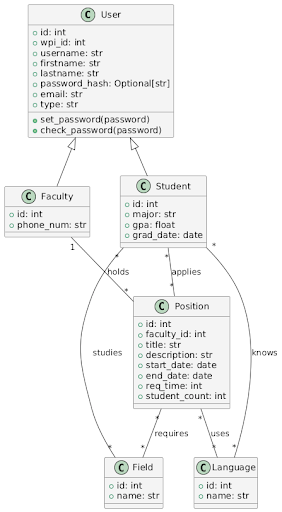
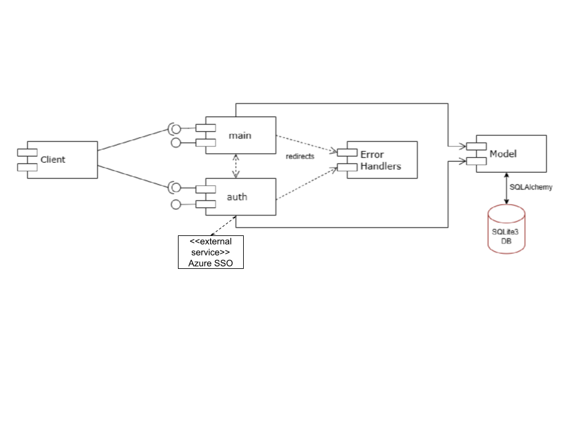

# Project Design Document
## ReSearch
--------
Prepared by:
* `Ian Wood`,`WPI`
* `Sarah Meyer`,`WPI`
* `April Zingher`,`WPI`
* `Connor Daniel`,`WPI`
---
**Course** : CS 3733 - Software Engineering
**Instructor**: Sakire Arslan Ay
---
## Table of Contents
- [Project Design Document](#project-design-document)
  - [ReSearch](#research)
  - [**Instructor**: Sakire Arslan Ay](#instructor-sakire-arslan-ay)
  - [Table of Contents](#table-of-contents)
    - [Document Revision History](#document-revision-history)
- [1. Introduction](#1-introduction)
- [2. Software Design](#2-software-design)
  - [2.1 Database Model](#21-database-model)
  - [2.2 Modules and Interfaces](#22-modules-and-interfaces)
    - [2.2.1 Overview](#221-overview)
    - [2.2.2 Interfaces](#222-interfaces)
      - [2.2.2.1 \<Auth\> Routes](#2221-auth-routes)
      - [2.2.2.2 \<Main\> Routes](#2222-main-routes)
    - [2.3 User Interface Design](#23-user-interface-design)
      - [Student Home](#student-home)
      - [Faculty Home](#faculty-home)
      - [Profile Pages](#profile-pages)
      - [Editing Profiles](#editing-profiles)
      - [Creating Research Positions (Faculty)](#creating-research-positions-faculty)
      - [Registration \& Authentication](#registration--authentication)
      - [Faculty-Specific Features](#faculty-specific-features)
- [3. References](#3-references)
### Document Revision History
| Name | Date | Changes | Version |
| ------ | ------ | --------- | --------- |
|Revision 1 |2024-11-15 |Initial draft | 1.0 |
|Revision 2 |2025-2-11 | Second draft | 1.5 |

# 1. Introduction
The purpose of this document is to illustrate our plan for the website.

# 2. Software Design

## 2.1 Database Model

<kbd>
      
</kbd>

The tables in our Model are: User, Student, Faculty, Position, Field, and Language. User is the table for all users. Student and Faculty are the tables to represent students and faculties. Position is used to represent the research positions from faculty that students can apply for. Field represents fields of research. Languages represent programming languages that are used in a project and that students can be proficient in.

## 2.2 Modules and Interfaces
### 2.2.1 Overview
<kbd>
  
</kdb>
Our application is very similar in structure to smile app. There exist three blueprints: main, auth, and errors. Auth handles authentication, such as logging in, registering, and using Azure SSO. Errors provides error templates for the website. Main contains the remaining functionality all users. Since there is significant overlap in faculty and student use cases, we chose to keep them integrated instead of separating them into two classes. This prevents duplication of code. Main connects with our model, which uses SQL Lite 3 db.

### 2.2.2 Interfaces
#### 2.2.2.1 \<Auth> Routes
| | Methods | URL Path | Description |
|:--|:------------------|:-----------|:-------------|
|1. |Get, Post |/user/register |Registers a user into the database |
|3. |Get, Post |/user/login |Used to login a user, so they can access the website |
|4. |Get |/user/logout |Used to logout a user |

#### 2.2.2.2 \<Main> Routes
| | Methods | URL Path | Description |
|:--|:------------------|:-----------|:-------------|
|1. | Get|/index |The main route where users can view projects. |
|2. |Get, Post |/position/creation |Faculty create research positions |
|3. |Get, Post |/field/<field_id>/edit |Faculty can create, edit, or remove research fields.|
|4. |Get, Post |/language/<language_id>/edit |Faculty can create, edit, or remove languages.|
|5. |Get, Post |/profile/<user_id> |Users can view their own profile. Faculty can view others' profiles and accept/reject recommendations.|
|6. |Get, Post |/profile/<user_id>/edit |Users can edit their own profile.|
|7. |Get, Post |/positions/faculty | Students can view the positions they have applied to and those they have been accepted for.|
|8. |Get |/positions/student |allows student to see their accepted and applied to positions |
|9. |Post |/faculty/recommendation/<student_id> | Faculty can submit a recommendation for a student.|
|10. |Get| /application/<application_id>/view | Faculty can view student applications|
|11. |Get, Post |/application/<position_id>/submission | Students can submit an application for a position. |
|12. |Get, Post |/application/<application_id>/approval | Faculty can accept a student application. |
|13. |Get, Post |/application/<application_id>/rejection | Faculty can reject a student application. |
|14. |Post |/application/<position_id>/withdrawal | Students can withdraw their application from a research position.|

### 2.3 User Interface Design

See image “UI Mockup.png”
<kbd>
      
</kbd>

Pictured above is our UI Mockup. Every page includes a clear header and footer with the appropriate tabs for that user.  

#### Student Home  
- Displays research positions with dropdowns for each position. 
- Includes application status 
- Includes an **Apply** button, which triggers a pop-up form.  

#### Faculty Home  
- Identical to the Student Home but **without** the Apply button.  

#### Profile Pages  
- **Students**: View personal information, edit profile, and track research applications.  
- **Faculty**: View personal information, edit profile, and manage research projects and student applications.  

#### Editing Profiles  
- Clicking **Edit Profile** redirects to a new page with relevant information pre-filled.  

#### Creating Research Positions (Faculty)  
- Faculty can click a button in the navbar to create a research position.  
- They are redirected to a form where they can:  
  - Complete fields with relevant information.  
  - Add and delete fields and languages as needed.  

#### Registration & Authentication  
- Students and faculty register using an identical form with a dropdown to select their user type.  
- All users sign in using a **username and password**.  
- A **Register** button is available at the bottom of the sign-in page.  

#### Faculty-Specific Features  
- Faculty can view:  
  - Research projects they oversee and the associated student applications.  
  - Individual student applications and profile information.  
  - **Recommendation requests** from their profile.  

# 3. References
Project Requirements Document, Sakire Aslan Ay
