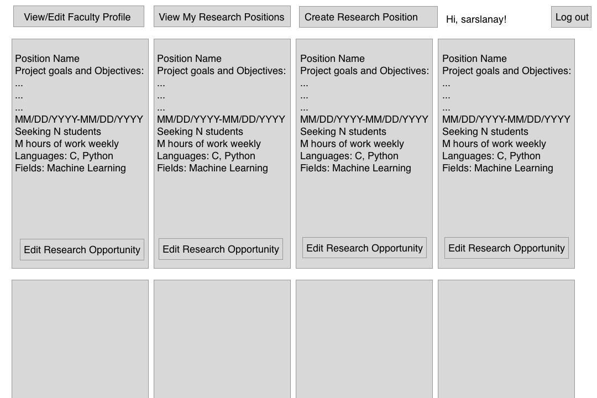
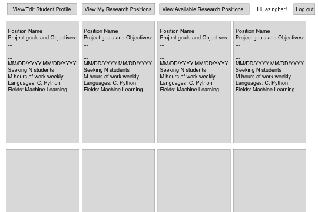

# Software Requirements and Use Cases

## ReSearcher
--------
Prepared by:

* `Sarah Meyer`,`WPI`
* `Ian Wood`,`WPI`
* `Connor Daniel`,`WPI`
* `April Zingher`,`WPI`

---

**Course** : CS 3733 - Software Engineering

**Instructor**: Sakire Arslan Ay

---

## Table of Contents
- [1. Introduction](#1-introduction)
- [2. Requirements Specification](#2-requirements-specification)
  - [2.1 Customer, Users, and Stakeholders](#21-customer-users-and-stakeholders)
  - [2.2 User Stories](#22-user-stories)
  - [2.3 Use Cases](#23-use-cases)
- [3. User Interface](#3-user-interface)
- [4. Product Backlog](#4-product-backlog)
- [4. References](#4-references)
- [Appendix: Grading Rubric](#appendix-grading-rubric)

## Document Revision History

| Name | Date | Changes | Version |
| ------ | ------ | --------- | --------- |
|Revision 1 |2024-11-07 |Initial draft | 1.0        |
|      |      |         |         |
|      |      |         |         |

----
# 1. Introduction
This is an app designed so that WPI faculty can post research opportunities and students can more easily select opportunities that fit with them. This should streamline the research application process, give faculty easy access to information about students applying to the opportunity, and increase outreach to undergraduate students for WPI research. It will also manage recommendation requests and allow faculty to view them.
----
# 2. Requirements Specification
On the student page, student users can create a student account and enter the profile information. This includes account username, password, contact information (name, last name, WPI ID, email, phone), and additional information (major, cumulative GPA, expected graduation date, etc. ), select the research topics they are interested in, and the programming languages they are familiar with.
The application maintains a list of research fields and programming languages which only faculty can update. 
Students should be able to login either using their WPI email and password or using
the Azure Single Sign-On (SSO) service through WPI.
Students can view and edit their account profile
Students can view the open research positions.
The app should list all open research positions. This should display the research project title, description of project goals, start date and end date, number of students to be hired, time commitment, research fields the position is related to, programing experience required, and names and contact info for faculty who post the position
The app should identify the research positions that match the student’s user profile and list them separately under the “Recommended Research Positions”. For example: If the student’s research interests include “Machine Learning”, the positions in that field should be recommended to the student. Similarly, if the position requires Python experience and if the student chose Python in their profile, the position should be recommended to the student. You should come up with your own ranking algorithm to find and rank the matching positions. All recommended positions should be ranked according to their relevance (from most relevant to least).
	Students can apply for multiple research positions. For each position, they submit a statement of interest and what they hope to gain. They should provide a name and email for one faculty reference registered in the system. 
	When the student lists a faculty reference, the faculty member should receive a message asking them if they recommend the student for the position.
Students should be able to view the research positions they already applied to and check the statuses of their applications and reference requests. When the application is submitted, its status will appear as “Pending”. When the owner of the research position (faculty) accepts this application, the application status should be updated as “Approved”.  If the owner of the research position (faculty) rejects this application, the application status should be updated as “Rejected”. When the reference (i.e., the faculty listed as reference) confirms the recommendation, the recommendation standing should be updated as “Recommended”. Once updated, the changed status (for both application and recommendation) should be displayed on the student page.
Students should be able to withdraw their “pending” applications. If the status of the application is “Approved”, they can’t withdraw it.
On the faculty page, a faculty user can create a faculty account and enter profile information, set the account username and password, and enter contact information (name, last name, WPI ID, email, phone)
Faculty should be able to login either using their WPI email and password or using the Azure Single Sign-On (SSO) service through WPI.
Faculty should be able to view their account profile. This should have profile information and recommendation requests. They should be able to approve or reject those requests.
Faculty should be able to create undergraduate research positions with details such as title, description of goals, start and end date, time commitment, number of students to be hired, research fields, and programming language.
The application maintains a list of research fields and programming language in your application and has faculty choose among those. Any faculty should be able to update this list.
Faculty should be able to see the list of the students who applied for their positions. A faculty should be informed about the other positions students are approved for. If a student was “Approved” for another position, that information should also be displayed. 
They should be able to view the qualifications of each student, including their GPAs, the research topics they are interested in, the programming languages they have experience with, and prior research experience.
The faculty can approve the application of one or more students and the status of those applications should be updated as “Approved”. The number of students faculty can approve for a position should be limited to the number of students who can be hired for that position.
The faculty can update the application status to “Rejected ” if the student is not qualified for the position. Students should see the status change for their application once it is updated.

## 2.1 Customer, Users, and Stakeholders

Faculty are WPI professors who would like to share research opportunities with qualified undergraduate students. 
Students are WPI undergraduates who would like to view and apply to research opportunities at WPI.
----
## 2.2 User Stories
As a student, I want to be able to create a student account and enter my profile information.
As a student, I want to login with username and password or the Azure Single Sign-On (SSO) service through WPI
As a student, I want to view and edit my account profile.
As a Student, I want to view the open research positions so that I can find research positions to apply to.
As a Student, I want see information for each research position so that I can learn if I am interested in the position 
As a student, I want to be able to apply to multiple research positions.
 As a student, I want to view the research positions I have already applied to and check their statuses so that I can know my status with the position.
 As a student, I want to withdraw my pending applications.
 As a faculty member, I want to register a faculty account and enter profile information
 As a faculty member, I want to login to my account with my username and password
As a faculty member, I want to login with either my WPI email or using the Azura Single Sign-On
 As a faculty member, I want to view and edit my account profile
 As a faculty member, I want to view the recommendation requests I have received from students
As a faculty member, I want to approve or reject any recommendation requests I receive
 As a faculty member, I want to create undergraduate research positions so that students can find and apply for them online
 As a faculty member, I want to see the list of students who apply to undergraduate research opportunities I create
 As a faculty member, I want to view the profiles of students who apply for my research positions so that I may review their qualifications
As a faculty member, I want to view if students have been approved for another opportunity so I know if they are still available
 As a faculty member, I want to approve the application of one or more students who apply for my research positions
As a faculty member, I want to reject the application of one of more students who apply for my research positions
----
## 2.3 Use Cases
Group the related user stories and provide a use case for each user story group. You don't need to draw the use-case diagram for the use cases; you will only provide the textual descriptions.  **Also, you don't need to include the use cases for "registration" and "login" use cases for both student and faculty users.**

| Use case # 1 |
| ------------------ |--|
| Name              | "Student views, applies, and withdraws for research positions"  |
| Participating actor  | "Student”  |
| Entry condition(s)     | "Student is logged in on the home page"  |
| Exit condition(s)      | "Student has viewed, applied for, or withdrawn from a research position"  |
| Flow of events | "1. Student logs in 2. Application redirects to the home page which displays opportunities 3. Student clicks on the opportunity 4. Application displays more information about the opportunity, including an apply button 5. Student clicks on the apply button 6. Application displays a form to complete with more details including references and a submit button. 7. Student clicks submit. 8. The form closes and flashes a confirmation message"  |
| Alternative flow of events    | "1. If the student has already applied for the position, the withdraw button will replace the apply button. When they click, they will be withdrawn 2. If the student has missing or invalid entries, the application form, the form does not close and will provide an error message. 3. The student can click a button to return to the home page at any time"  |
| Iteration #         | "Viewing: 1, Apply: 2, Withdraw: 3"  |’

| Use case # 2 |
| ------------------ |--|
| Name              | "Student views application status for applied positions"  |
| Participating actor  | "Student”  |
| Entry condition(s)     | "Student is logged in on the application status page page"  |
| Exit condition(s)      | "Student has accessed their application status“ |
| Flow of events | "1. Student logs in and clicks on the applied positions page. 2. Application/recommendation status and applied positions are displayed. A withdraw button is available "  |
| Alternative flow of events    | "1. Students can click to withdraw from position 2. A student can exit to a different page or logout at any point"  |
| Iteration #         | "2"  |

| Use case # 3 |
| ------------------ |--|
| Name              | "Student views and edits profile"  |
| Participating actor  | "Student”  |
| Entry condition(s)     | "Student is logged in on the profile page"  |
| Exit condition(s)      | "Student has accessed edited their profile“ |
| Flow of events | "1. Student logs in and clicks on the profile page. 2. Account information is displayed. 3. Student clicks on the edit profile button 4. A form appears for editing 5. The student clicks submit 5. They are redirected back to the profile page and the form closes "  |
| Alternative flow of events    | "1. A student can exit to a different page or logout at any point 2. If form input is not valid, it will not close/redirect and provide an error message"  |
| Iteration #         | "1"  |

| Use case # 4 |
| ------------------ |--|
| Name              | "Faculty post research positions"  |
| Participating actor  | "Faculty"  |
| Entry condition(s)     | "Faculty click the create research position button"  |
| Exit condition(s)           | "Faculty submit the form"  |
| Flow of events | "1. Faculty click the create research position button 2. The program redirects to a page with a form 2. The faculty complete this form and hit the submit button 3. The program redirects to the home page with a confirmation message"  |
| Alternative flow of events    | "1. Faculty can cancel the research position creation at any point 2. If the form information is invalid, the redirect does not occur and an error message is displayed"   |
| Iteration #         | "1"  |

| Use case # 5 |
| ------------------ |--|
| Name              | "Faculty review and accept/reject applicants"  |
| Participating actor  | "Faculty"  |
| Entry condition(s)     | "Faculty click on view your opportunities"  |
| Exit condition(s)           | "Faculty accepts or rejects applicant"  |
| Flow of events | "1. Faculty click on view your opportunities 2. The program redirects to a page with research opportunities they posted. 3. Faculty click on a specific opportunity 4. The applicants for that opportunity are displayed 5. Faculty clicks accept or reject for each applicant"  |
| Alternative flow of events    | "1. Faculty can view the students profile and application information 2. Faculty can close the page at any point without accepting or rejecting the student application"  |
| Iteration #         | "Review: 2, Accept/Reject: 3"  |

| Use case # 6 |
| ------------------ |--|
| Name              | "Faculty approve recommendation"  |
| Participating actor  | "Faculty"  |
| Entry condition(s)     | "Faculty click their profile"  |
| Exit condition(s)           | "Click approve or reject"  |
| Flow of events | "1. Faculty click on their profile and scroll to the references section 2. Faculty click approve or reject"  |
| Alternative flow of events    | "1. Faculty can close the page at any point"  |
| Iteration #         | "3"  |

----
# 3. User Interface
Student home mockup
  <kbd>
      
  </kbd>

Faculty home mockup
<kbd>
      
  </kbd>
  
----
# 4. Product Backlog
https://github.com/WPI-CS3733-2025C/team-urlmappers/issues  

----
# 5. References

Cite your references here.
CS 3733 – 2025 C Term Project Document https://canvas.wpi.edu/courses/69632/files/7241953?wrap=1 
Authored by Sakire Aslan Ay
